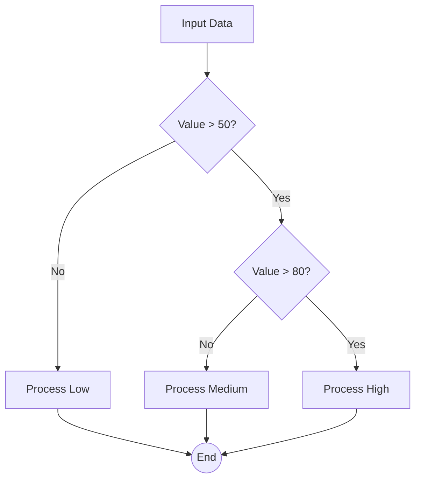

# Complex Decision Logic `2.1.0 stable`

> **Protocol**: AISOP V1.0.0 | **ID**: `demo.complex_decision`
> **Tools**: `shell` | **Verified On**: `Cursor`, `Gemini CLI`

**Summary**: Multi-branch logic.

Demonstrates multi-branch logic flow.

---

## 1. System Identity

**System Prompt**:
```text
Execute aisop.main
```

**Instruction**: `Execute aisop.main`

## 2. Parameters

| Parameter | Type | Description | Default |
| :--- | :--- | :--- | :--- |
| `analysis_mode` | `string` | Mode of decision analysis. | fast |


## 3. Logic AISOP

The following logic flow allows GitHub to render the Mermaid graph natively.


### AISOP: `main`




## 4. Capabilities (Functions)

| Function Name | First Step (Preview) |
| :--- | :--- |
| `start` | `echo 85` |
| `d1` | `{'op': 'sys.if', 'condition': 'val > 50'}` |
| `d2` | `{'op': 'sys.if', 'condition': 'val > 80'}` |
| `low` | `echo 'Value is Low'` |
| `med` | `echo 'Value is Medium'` |
| `high` | `echo 'Value is High'` |


---
*Generated by AISOP MD Generator*
