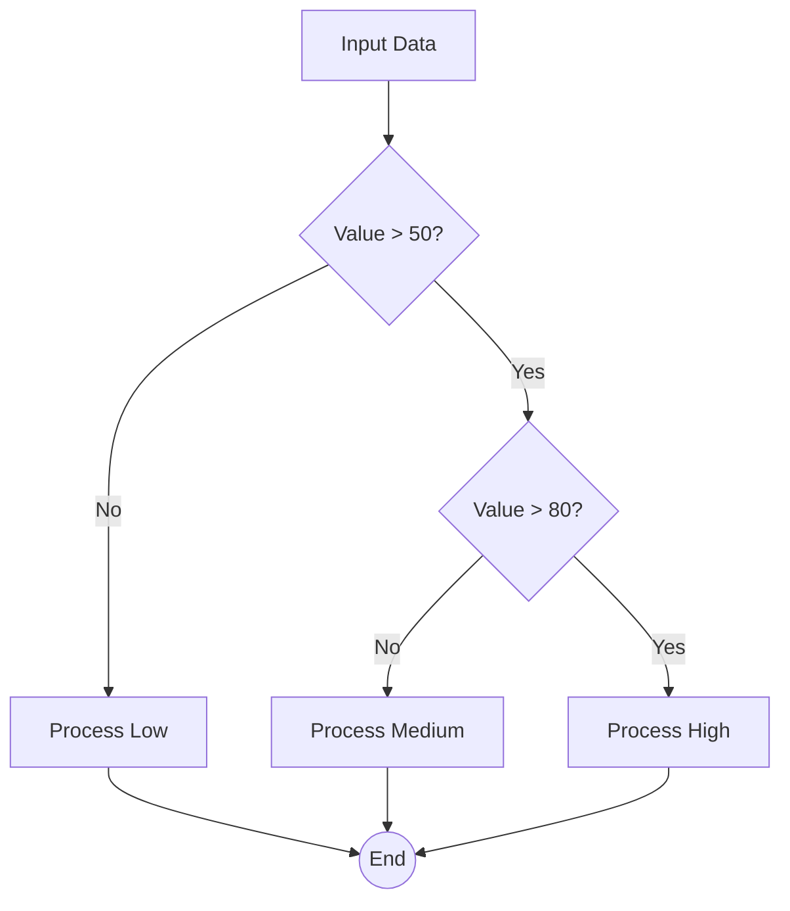

# Complex Decision Logic `2.1.0 stable`

> **Protocol**: AISOP V3.1 | **ID**: `demo.complex_decision`  
> **Tools**: `shell` | **Verified On**: `Cursor`, `Gemini CLI`

Demonstrates multi-branch logic flow.

---

## 1. System Identity

**System Prompt**:
```text
Run blueprints.main
```

## 2. Logic Blueprints

The following logic flow allows GitHub to render the Mermaid graph natively.


### Blueprint: `main`


```mermaid
graph TD
  start[Input Data] --> d1{Value > 50?}
  d1 -->|Yes| d2{Value > 80?}
  d1 -->|No| low[Process Low]
  d2 -->|Yes| high[Process High]
  d2 -->|No| med[Process Medium]
  low --> endNode((End))
  med --> endNode
  high --> endNode
```


## 3. Capabilities (Functions)

| Function Name | First Step (Preview) |
| :--- | :--- |
| `start` | `echo 85` |
| `d1` | `{'op': 'sys.if', 'condition': 'val > 50'}` |
| `d2` | `{'op': 'sys.if', 'condition': 'val > 80'}` |
| `low` | `echo 'Value is Low'` |
| `med` | `echo 'Value is Medium'` |
| `high` | `echo 'Value is High'` |


---
*Generated by AISOP MD Generator*
