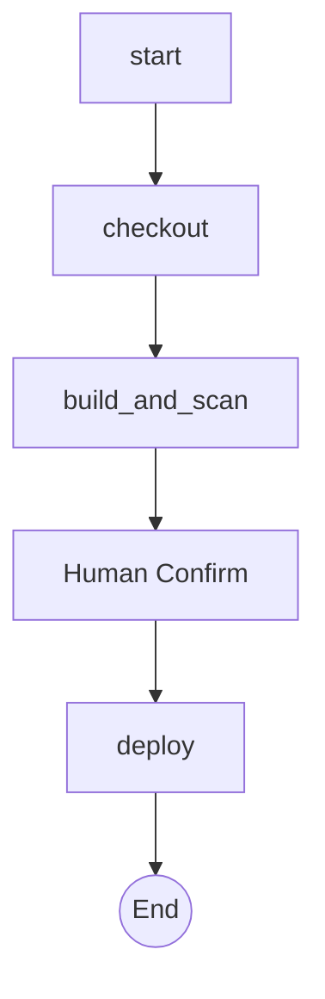
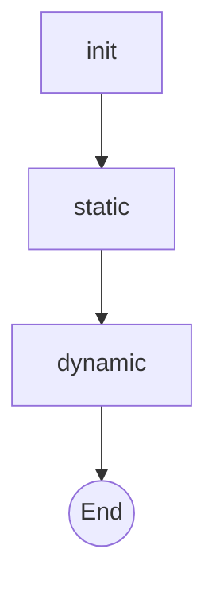

# Complex Deployment Flow `2.1.0 stable`

> **Protocol**: AISOP V1.0.0 | **ID**: `complex.deployment`
> **Tools**: `shell`, `git`, `file_io` | **Verified On**: `Cursor`, `Gemini CLI`

**Summary**: Demonstrates the 'Step-Map' sequence and explicit references.

A complex example showcasing the full power of AISOP: Ordered Steps, Explicit References, and Fractal AISOP.

---

## 1. System Identity

**System Prompt**:
```text
Execute aisop.main
```

**Instruction**: `Execute aisop['main']. use functions or aisop as tools.`

## 2. Parameters

| Parameter | Type | Description | Default |
| :--- | :--- | :--- | :--- |
| `log_level` | `string` | Logging verbosity level (e.g. DEBUG, INFO, WARN, ERROR). | INFO |


## 3. Logic AISOP

The following logic flow allows GitHub to render the Mermaid graph natively.


### AISOP: `main`



### AISOP: `security_scan`




## 4. Capabilities (Functions)

| Function Name | First Step (Preview) |
| :--- | :--- |
| `checkout` | `git checkout main` |
| `build_and_scan` | `echo 'Starting Build & Scan Sequence...'` |
| `run_tests` | `npm run test:unit` |
| `confirm_deploy` | `{'op': 'sys.io.confirm', 'message': 'Deploy to production...` |
| `deploy` | `kubectl apply -f deployment.yaml` |


---
*Generated by AISOP MD Generator*
