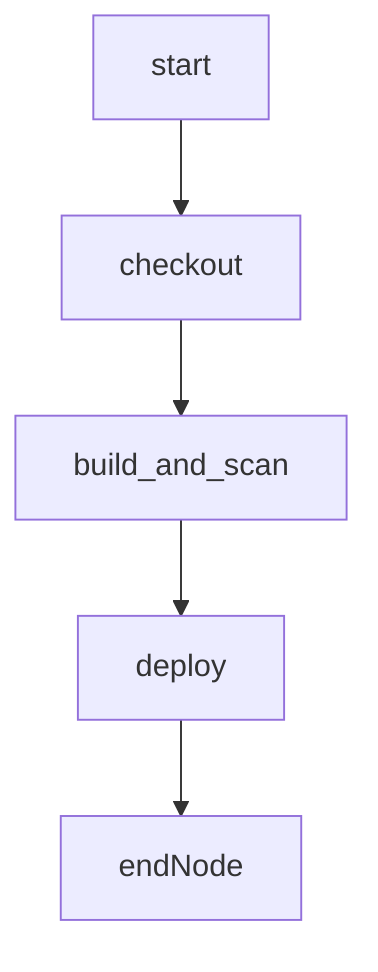
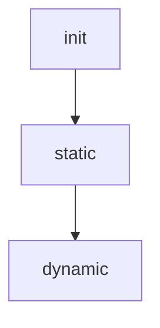

# Complex Deployment Flow `2.1.0 stable`

> **Protocol**: AISOP V3.1 | **ID**: `complex.deployment`  
> **Tools**: `shell`, `git`, `file_io` | **Verified On**: `Cursor`, `Gemini CLI`

A complex example showcasing the full power of V3: Ordered Steps, Explicit References, and Fractal Blueprints.

---

## 1. System Identity

**System Prompt**:
```text
Execute blueprints.main
```

## 2. Logic Blueprints

The following logic flow allows GitHub to render the Mermaid graph natively.


### Blueprint: `main`


```mermaid
graph TD
  start --> checkout
  checkout --> build_and_scan
  build_and_scan --> deploy
  deploy --> endNode
```

### Blueprint: `security_scan`


```mermaid
graph TD
  init --> static --> dynamic
```


## 3. Capabilities (Functions)

| Function Name | First Step (Preview) |
| :--- | :--- |
| `checkout` | `git checkout main` |
| `build_and_scan` | `echo 'Starting Build & Scan Sequence...'` |
| `run_tests` | `npm run test:unit` |
| `deploy` | `kubectl apply -f deployment.yaml` |


---
*Generated by AISOP MD Generator*
