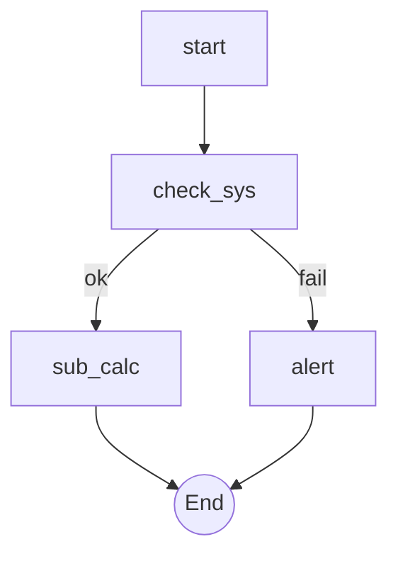
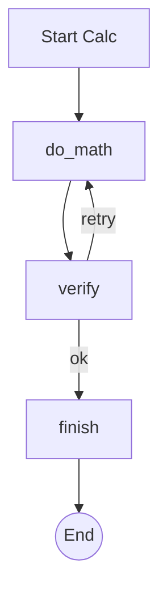

# Fractal Logic Demo `3.2.0 stable`

> **Protocol**: AISOP V1.0.0 | **ID**: `demo.fractal`
> **Tools**: `shell` | **Verified On**: `Cursor`, `Gemini CLI`

**Summary**: Demonstrates the AISOP Structure: Metadata -> AISOP -> Functions.

Demonstrates the Fractal Architecture.

---

## 1. System Identity

**System Prompt**:
```text
Execute aisop.main
```

**Instruction**: `Execute aisop['main'].`

## 2. Parameters

| Parameter | Type | Description | Default |
| :--- | :--- | :--- | :--- |
| `recursion_limit` | `integer` | Maximum depth of fractal execution. | 3 |


## 3. Logic AISOP

The following logic flow allows GitHub to render the Mermaid graph natively.


### AISOP: `main`



### AISOP: `sub_calc`




## 4. Capabilities (Functions)

| Function Name | First Step (Preview) |
| :--- | :--- |
| `check_sys` | `echo System OK` |
| `alert` | `echo '🚨 System Failure!'` |
| `do_math` | `{'op': 'sys.llm', 'prompt': 'Calculate 5 * 5'}` |
| `verify` | `{'op': 'sys.if', 'expr': 'result == 25'}` |
| `finish` | `echo 'Calculation Complete!'` |
| `sub_calc` | `aisop['sub_calc']` |


---
*Generated by AISOP MD Generator*
