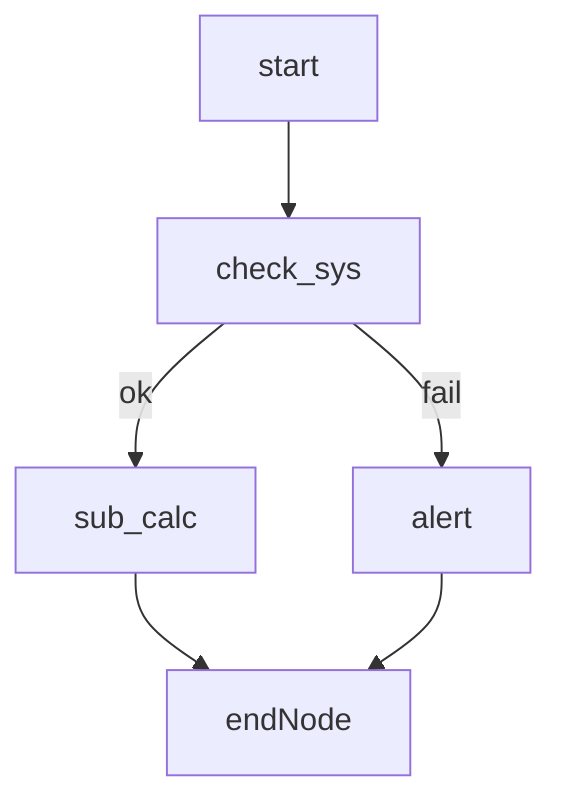
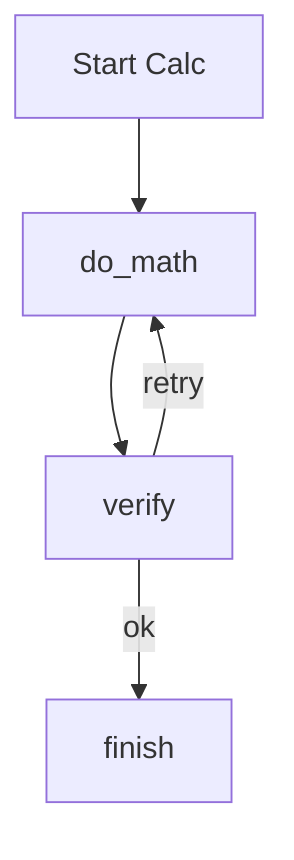

# Fractal Logic Demo `3.2.0 stable`

> **Protocol**: AISOP V3.1 | **ID**: `demo.fractal`  
> **Tools**: `shell` | **Verified On**: `Cursor`, `Gemini CLI`

Demonstrates the Fractal V3 Architecture.

---

## 1. System Identity

**System Prompt**:
```text
Execute blueprints.main
```

## 2. Logic Blueprints

The following logic flow allows GitHub to render the Mermaid graph natively.


### Blueprint: `main`


```mermaid
graph TD
  start --> check_sys
  check_sys -->|ok| sub_calc
  check_sys -->|fail| alert
  sub_calc --> endNode
  alert --> endNode
```

### Blueprint: `sub_calc`


```mermaid
graph TD
  calc_start[Start Calc] --> do_math
  do_math --> verify
  verify -->|ok| finish
  verify -->|retry| do_math
```


## 3. Capabilities (Functions)

| Function Name | First Step (Preview) |
| :--- | :--- |
| `check_sys` | `echo System OK` |
| `alert` | `echo '🚨 System Failure!'` |
| `do_math` | `{'op': 'sys.llm', 'prompt': 'Calculate 5 * 5'}` |
| `verify` | `{'op': 'sys.if', 'expr': 'result == 25'}` |
| `finish` | `echo 'Calculation Complete!'` |
| `sub_calc` | `blueprints['sub_calc']` |


---
*Generated by AISOP MD Generator*
