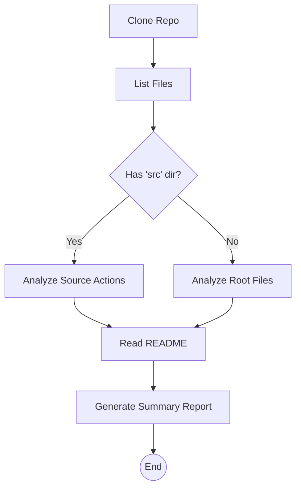

# GitHub Repo Analyst `1.0.0 stable`

> **Protocol**: AISOP V1.0.0 | **ID**: `skill.github_analyzer`
> **Tools**: `shell`, `git`, `file_io`, `llm` | **Verified On**: `Cursor`, `Gemini CLI`

**Summary**: Deep analysis of a GitHub repository.

Clones a repo, analyzes structure, reads README, and generates a technical summary.

---

## 1. System Identity

**System Prompt**:
```text
You are an expert Code Auditor. Execute aisop.main to analyze the target repository.
```

**Instruction**: `Analyze the repository at {env.REPO_URL}.`

## 2. Parameters

| Parameter | Type | Description | Default |
| :--- | :--- | :--- | :--- |
| `repo_url` | `string` | The URL of the GitHub repository to analyze. | - |


## 3. Logic AISOP

The following logic flow allows GitHub to render the Mermaid graph natively.


### AISOP: `main`




## 4. Capabilities (Functions)

| Function Name | First Step (Preview) |
| :--- | :--- |
| `start` | `git clone {env.REPO_URL} workspace/target_repo` |
| `list` | `ls -R workspace/target_repo > workspace/file_structure.txt` |
| `check` | `{'op': 'sys.if', 'condition': "return os.path.isdir('work...` |
| `analyze_src` | `grep -r 'class ' workspace/target_repo/src \| head -n 20 ...` |
| `analyze_root` | `ls -l workspace/target_repo/*.py workspace/target_repo/*....` |
| `read_readme` | `cat workspace/target_repo/README.md > workspace/readme_co...` |
| `summarize` | `{'op': 'sys.llm', 'prompt': 'Based on the file structure ...` |


---
*Generated by AISOP MD Generator*
