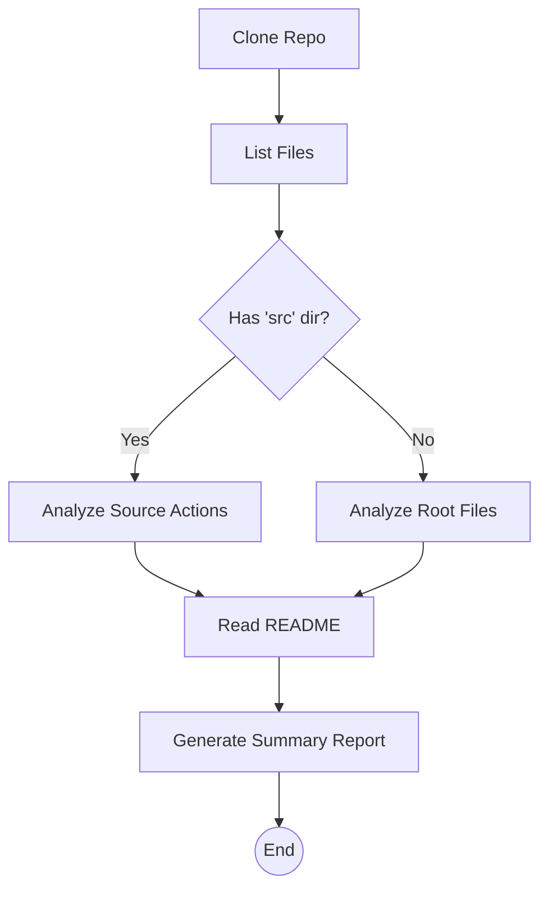

# GitHub Repo Analyst `1.0.0 stable`

> **Protocol**: AISOP V3.1 | **ID**: `skill.github_analyzer`  
> **Tools**: `shell`, `git`, `file_io`, `llm` | **Verified On**: `Cursor`, `Gemini CLI`

Clones a repo, analyzes structure, reads README, and generates a technical summary.

---

## 1. System Identity

**System Prompt**:
```text
You are an expert Code Auditor. Execute blueprints.main to analyze the target repository.
```

## 2. Logic Blueprints

The following logic flow allows GitHub to render the Mermaid graph natively.


### Blueprint: `main`


```mermaid
graph TD
  start[Clone Repo] --> list[List Files]
  list --> check{Has 'src' dir?}
  check -->|Yes| analyze_src[Analyze Source Actions]
  check -->|No| analyze_root[Analyze Root Files]
  analyze_src --> read_readme[Read README]
  analyze_root --> read_readme
  read_readme --> summarize[Generate Summary Report]
  summarize --> endNode((End))
```


## 3. Capabilities (Functions)

| Function Name | First Step (Preview) |
| :--- | :--- |
| `start` | `git clone ${{ env.REPO_URL }} workspace/target_repo` |
| `list` | `ls -R workspace/target_repo > workspace/file_structure.txt` |
| `check` | `{'op': 'sys.if', 'condition': "return os.path.isdir('work...` |
| `analyze_src` | `grep -r 'class ' workspace/target_repo/src \| head -n 20 ...` |
| `analyze_root` | `ls -l workspace/target_repo/*.py workspace/target_repo/*....` |
| `read_readme` | `cat workspace/target_repo/README.md > workspace/readme_co...` |
| `summarize` | `{'op': 'sys.llm.generate', 'prompt': 'Based on the file s...` |


---
*Generated by AISOP MD Generator*
