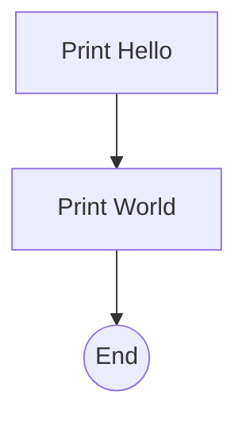

# Hello AISOP `2.1.0 stable`

> **Protocol**: AISOP V1.0.0 | **ID**: `demo.hello_world`
> **Tools**: `shell` | **Verified On**: `Cursor`, `Gemini CLI`

**Summary**: A simple Hello World example.

A simple Hello World demonstration.

---

## 1. System Identity

**System Prompt**:
```text
Execute aisop.main
```

**Instruction**: `Execute aisop['main'].`

## 2. Parameters

| Parameter | Type | Description | Default |
| :--- | :--- | :--- | :--- |
| `name` | `string` | Who to say hello to (optional). | World |


## 3. Logic AISOP

The following logic flow allows GitHub to render the Mermaid graph natively.


### AISOP: `main`




## 4. Capabilities (Functions)

| Function Name | First Step (Preview) |
| :--- | :--- |
| `h` | `echo Hello` |
| `w` | `echo World` |


---
*Generated by AISOP MD Generator*
