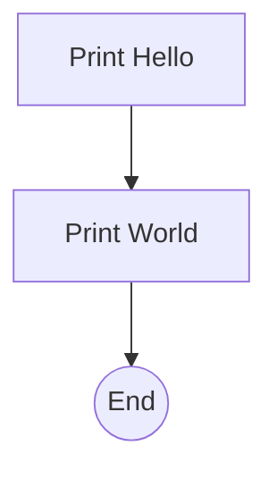

# Hello AISOP (v3) `2.1.0 stable`

> **Protocol**: AISOP V3.1 | **ID**: `demo.hello_world`  
> **Tools**: `shell` | **Verified On**: `Cursor`, `Gemini CLI`

A simple Hello World demonstration.

---

## 1. System Identity

**System Prompt**:
```text
Execute blueprints.main
```

## 2. Logic Blueprints

The following logic flow allows GitHub to render the Mermaid graph natively.


### Blueprint: `main`


```mermaid
graph TD
  h[Print Hello] --> w[Print World]
  w --> endNode((End))
```


## 3. Capabilities (Functions)

| Function Name | First Step (Preview) |
| :--- | :--- |
| `h` | `echo Hello` |
| `w` | `echo World` |


---
*Generated by AISOP MD Generator*
