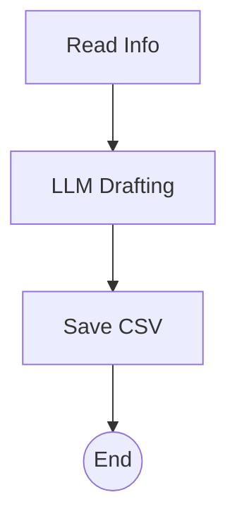

# Marketing Tweet Generator `2.1.0 stable`

> **Protocol**: AISOP V1.0.0 | **ID**: `marketing.tweet_gen`
> **Tools**: `file_io`, `llm` | **Verified On**: `Cursor`, `Gemini CLI`

**Summary**: Generates tweets.

Generates viral marketing tweets from product docs.

---

## 1. System Identity

**System Prompt**:
```text
Execute aisop.main
```

**Instruction**: `Execute aisop.main`

## 2. Parameters

| Parameter | Type | Description | Default |
| :--- | :--- | :--- | :--- |
| `product_name` | `string` | Name of the product. | - |
| `key_features` | `array` | List of features to highlight. | - |


## 3. Logic AISOP

The following logic flow allows GitHub to render the Mermaid graph natively.


### AISOP: `main`




## 4. Capabilities (Functions)

| Function Name | First Step (Preview) |
| :--- | :--- |
| `read` | `cat product_release.md` |
| `generate` | `{'op': 'sys.llm', 'prompt': 'Write 3 viral tweets.'}` |
| `save` | `echo 'id,content 1,{nodes.generate.output}' > tweets...` |


---
*Generated by AISOP MD Generator*
