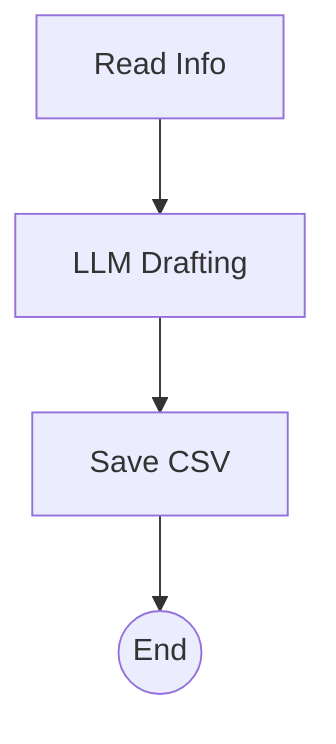

# Marketing Tweet Generator `2.1.0 stable`

> **Protocol**: AISOP V3.1 | **ID**: `marketing.tweet_gen`  
> **Tools**: `file_io`, `llm` | **Verified On**: `Cursor`, `Gemini CLI`

Generates viral marketing tweets from product docs.

---

## 1. System Identity

**System Prompt**:
```text
Execute blueprints.main
```

## 2. Logic Blueprints

The following logic flow allows GitHub to render the Mermaid graph natively.


### Blueprint: `main`


```mermaid
graph TD
  read[Read Info] --> generate[LLM Drafting]
  generate --> save[Save CSV]
  save --> endNode((End))
```


## 3. Capabilities (Functions)

| Function Name | First Step (Preview) |
| :--- | :--- |
| `read` | `cat product_release.md` |
| `generate` | `{'op': 'sys.llm', 'prompt': 'Write 3 viral tweets.'}` |
| `save` | `echo 'id,content 1,${{ nodes.generate.output }}' > tweets...` |


---
*Generated by AISOP MD Generator*
