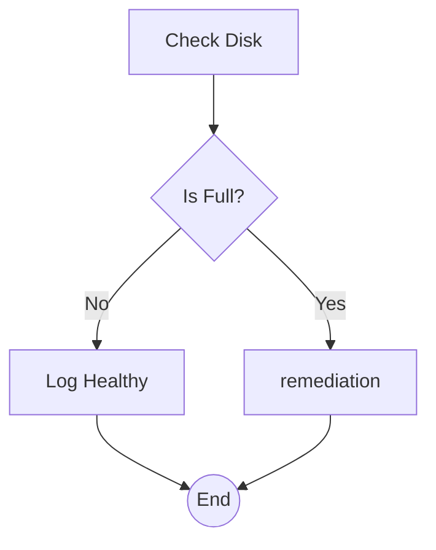
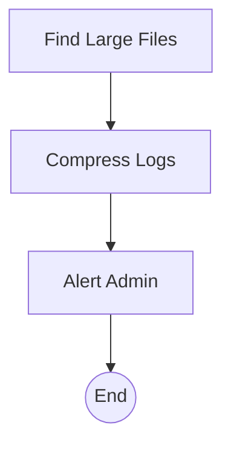

# Server Health Guardian `2.1.0 stable`

> **Protocol**: AISOP V1.0.0 | **ID**: `ops.server_health`
> **Tools**: `shell`, `file_io` | **Verified On**: `Cursor`, `Gemini CLI`

**Summary**: Checks disk usage.

Monitors server disk usage and auto-remediates.

---

## 1. System Identity

**System Prompt**:
```text
Execute aisop.main
```

**Instruction**: `Execute aisop.main`

## 2. Parameters

| Parameter | Type | Description | Default |
| :--- | :--- | :--- | :--- |
| `disk_threshold` | `integer` | Percentage usage to trigger alert. | 90 |


## 3. Logic AISOP

The following logic flow allows GitHub to render the Mermaid graph natively.


### AISOP: `main`



### AISOP: `remediation`




## 4. Capabilities (Functions)

| Function Name | First Step (Preview) |
| :--- | :--- |
| `start` | `echo 92` |
| `check` | `{'op': 'sys.if', 'condition': "return int('{nodes.star...` |
| `healthy` | `echo '✅ System healthy.'` |
| `remediation` | `aisop['remediation']` |
| `find` | `echo '/var/log/syslog.1 (5GB)'` |
| `compress` | `echo 'Compressing...'` |
| `alert` | `echo '[CRITICAL] High Disk Usage. Compressed large files....` |


---
*Generated by AISOP MD Generator*
