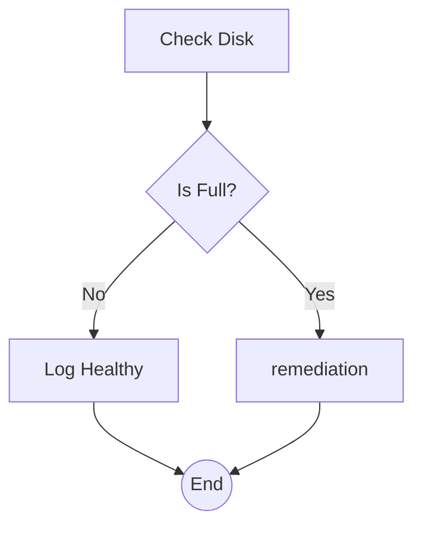
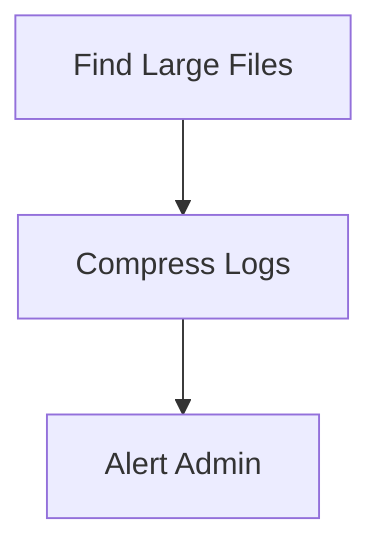

# Server Health Guardian (v3) `2.1.0 stable`

> **Protocol**: AISOP V3.1 | **ID**: `ops.server_health`  
> **Tools**: `shell`, `file_io` | **Verified On**: `Cursor`, `Gemini CLI`

Monitors server disk usage and auto-remediates.

---

## 1. System Identity

**System Prompt**:
```text
Execute blueprints.main
```

## 2. Logic Blueprints

The following logic flow allows GitHub to render the Mermaid graph natively.


### Blueprint: `main`


```mermaid
graph TD
  start[Check Disk] --> check{Is Full?}
  check -->|Yes| remediation
  check -->|No| healthy[Log Healthy]
  healthy --> endNode((End))
  remediation --> endNode
```

### Blueprint: `remediation`


```mermaid
graph TD
  find[Find Large Files] --> compress[Compress Logs]
  compress --> alert[Alert Admin]
```


## 3. Capabilities (Functions)

| Function Name | First Step (Preview) |
| :--- | :--- |
| `start` | `echo 92` |
| `check` | `{'op': 'sys.if', 'condition': "return int('${{ nodes.star...` |
| `healthy` | `echo '✅ System healthy.'` |
| `remediation` | `blueprints['remediation']` |
| `find` | `echo '/var/log/syslog.1 (5GB)'` |
| `compress` | `echo 'Compressing...'` |
| `alert` | `echo '[CRITICAL] High Disk Usage. Compressed large files....` |


---
*Generated by AISOP MD Generator*
