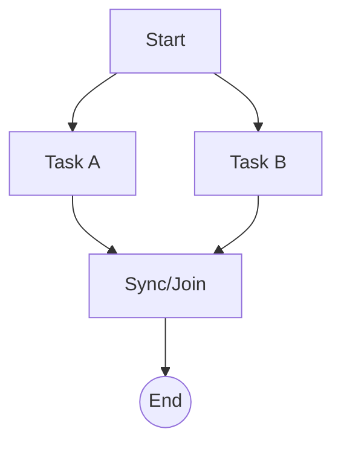

# Parallel Execution Demo `2.1.0 stable`

> **Protocol**: AISOP V1.0.0 | **ID**: `demo.parallel`
> **Tools**: `shell` | **Verified On**: `Cursor`, `Gemini CLI`

**Summary**: Parallel Execution.

Demonstrates parallel execution of tasks.

---

## 1. System Identity

**System Prompt**:
```text
Execute aisop.main
```

**Instruction**: `Execute aisop.main`

## 2. Parameters

| Parameter | Type | Description | Default |
| :--- | :--- | :--- | :--- |
| `batch_id` | `string` | ID of the processing batch. | - |


## 3. Logic AISOP

The following logic flow allows GitHub to render the Mermaid graph natively.


### AISOP: `main`




## 4. Capabilities (Functions)

| Function Name | First Step (Preview) |
| :--- | :--- |
| `start` | `echo 'Starting...'` |
| `taskA` | `echo Task A done` |
| `taskB` | `echo Task B done` |
| `sync` | `echo 'Both tasks finished.'` |


---
*Generated by AISOP MD Generator*
