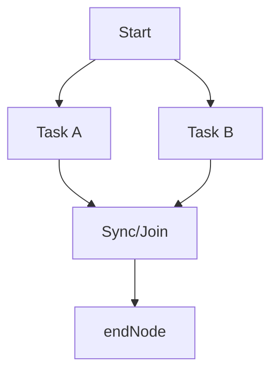

# Parallel Execution Demo `2.1.0 stable`

> **Protocol**: AISOP V3.1 | **ID**: `demo.parallel`  
> **Tools**: `shell` | **Verified On**: `Cursor`, `Gemini CLI`

Demonstrates parallel execution of tasks.

---

## 1. System Identity

**System Prompt**:
```text
Execute blueprints.main
```

## 2. Logic Blueprints

The following logic flow allows GitHub to render the Mermaid graph natively.


### Blueprint: `main`


```mermaid
graph TD
  start[Start] --> taskA[Task A]
  start --> taskB[Task B]
  taskA --> sync[Sync/Join]
  taskB --> sync
  sync --> endNode
```


## 3. Capabilities (Functions)

| Function Name | First Step (Preview) |
| :--- | :--- |
| `start` | `echo 'Starting...'` |
| `taskA` | `echo Task A done` |
| `taskB` | `echo Task B done` |
| `sync` | `echo 'Both tasks finished.'` |


---
*Generated by AISOP MD Generator*
