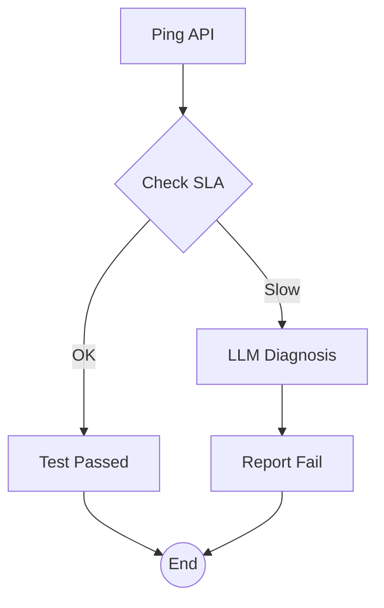

# API Latency Watchdog `2.1.0 stable`

> **Protocol**: AISOP V1.0.0 | **ID**: `qa.api_tester`
> **Tools**: `shell`, `llm`, `file_io` | **Verified On**: `Cursor`, `Gemini CLI`

**Summary**: Pings an API, diagnoses slowness.

Pings API and diagnoses latency issues using LLM.

---

## 1. System Identity

**System Prompt**:
```text
Execute aisop.main
```

**Instruction**: `Execute aisop.main`

## 2. Parameters

| Parameter | Type | Description | Default |
| :--- | :--- | :--- | :--- |
| `api_endpoint` | `string` | The base URL of the API to test. | - |


## 3. Logic AISOP

The following logic flow allows GitHub to render the Mermaid graph natively.


### AISOP: `main`




## 4. Capabilities (Functions)

| Function Name | First Step (Preview) |
| :--- | :--- |
| `ping` | `echo 600` |
| `check` | `{'op': 'sys.if', 'condition': 'val > 500'}` |
| `pass` | `echo '✅ API Latency OK.'` |
| `diag` | `{'op': 'sys.llm', 'prompt': 'API latency 600ms. Why?'}` |
| `report` | `echo 'Latency Violation: {nodes.ping.output}ms' > la...` |


---
*Generated by AISOP MD Generator*
