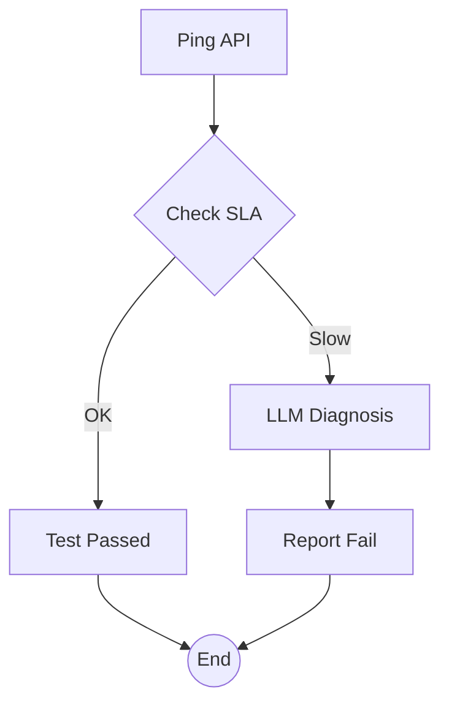

# API Latency Watchdog (v3) `2.1.0 stable`

> **Protocol**: AISOP V3.1 | **ID**: `qa.api_tester`  
> **Tools**: `shell`, `llm`, `file_io` | **Verified On**: `Cursor`, `Gemini CLI`

Pings API and diagnoses latency issues using LLM.

---

## 1. System Identity

**System Prompt**:
```text
Execute blueprints.main
```

## 2. Logic Blueprints

The following logic flow allows GitHub to render the Mermaid graph natively.


### Blueprint: `main`


```mermaid
graph TD
  ping[Ping API] --> check{Check SLA}
  check -->|OK| pass[Test Passed]
  check -->|Slow| diag[LLM Diagnosis]
  diag --> report[Report Fail]
  pass --> endNode((End))
  report --> endNode
```


## 3. Capabilities (Functions)

| Function Name | First Step (Preview) |
| :--- | :--- |
| `ping` | `echo 600` |
| `check` | `{'op': 'sys.if', 'condition': 'val > 500'}` |
| `pass` | `echo '✅ API Latency OK.'` |
| `diag` | `{'op': 'sys.llm', 'prompt': 'API latency 600ms. Why?'}` |
| `report` | `echo 'Latency Violation: ${{ nodes.ping.output }}ms' > la...` |


---
*Generated by AISOP MD Generator*
