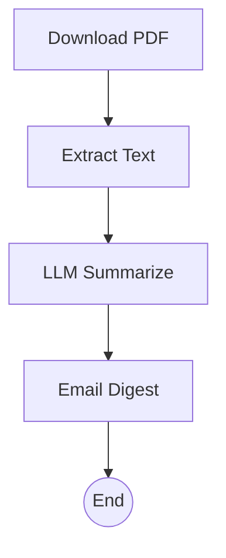

# Research Paper Digest `2.1.0 stable`

> **Protocol**: AISOP V1.0.0 | **ID**: `research.digest`
> **Tools**: `web_dl`, `file_io`, `llm` | **Verified On**: `Cursor`, `Gemini CLI`

**Summary**: Summarizes papers.

Download, extract, and summarize Arxiv papers.

---

## 1. System Identity

**System Prompt**:
```text
Execute aisop.main
```

**Instruction**: `Execute aisop.main`

## 2. Parameters

| Parameter | Type | Description | Default |
| :--- | :--- | :--- | :--- |
| `paper_url` | `string` | URL of the paper to digest. | - |


## 3. Logic AISOP

The following logic flow allows GitHub to render the Mermaid graph natively.


### AISOP: `main`




## 4. Capabilities (Functions)

| Function Name | First Step (Preview) |
| :--- | :--- |
| `dl` | `wget http://arxiv.org/pdf/1234.pdf` |
| `extract` | `pdftotext 1234.pdf` |
| `sum` | `{'op': 'sys.llm', 'prompt': 'Summarize this paper...'}` |
| `email` | `echo 'Email sent.'` |


---
*Generated by AISOP MD Generator*
