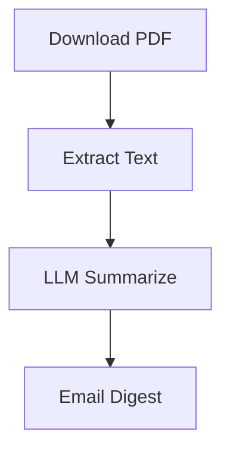

# Research Paper Digest `2.1.0 stable`

> **Protocol**: AISOP V3.1 | **ID**: `research.digest`  
> **Tools**: `web_dl`, `file_io`, `llm` | **Verified On**: `Cursor`, `Gemini CLI`

Download, extract, and summarize Arxiv papers.

---

## 1. System Identity

**System Prompt**:
```text
Execute blueprints.main
```

## 2. Logic Blueprints

The following logic flow allows GitHub to render the Mermaid graph natively.


### Blueprint: `main`


```mermaid
graph TD
  dl[Download PDF] --> extract[Extract Text]
  extract --> sum[LLM Summarize]
  sum --> email[Email Digest]
```


## 3. Capabilities (Functions)

| Function Name | First Step (Preview) |
| :--- | :--- |
| `dl` | `wget http://arxiv.org/pdf/1234.pdf` |
| `extract` | `pdftotext 1234.pdf` |
| `sum` | `{'op': 'sys.llm', 'prompt': 'Summarize this paper...'}` |
| `email` | `echo 'Email sent.'` |


---
*Generated by AISOP MD Generator*
