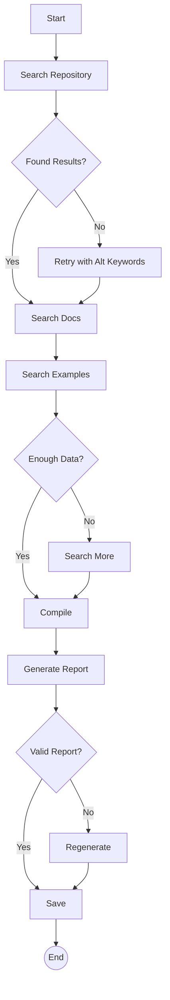

# AISOP Repository Search & Report `1.1.0 stable`

> **Protocol**: AISOP V1.0.0 | **ID**: `demo.search_aisop_repo`
> **Tools**: `web_search`, `file_io` | **Verified On**: `Cursor`, `Gemini CLI`, `ChatGPT`, `Claude`

**Summary**: Searches the web for AISOP repository content and generates an analysis report.

A protocol that uses web search to find all content about the AISOP repository and generate an analysis report. Includes error handling and validation.

---

## 1. System Identity

**System Prompt**:
```text
You are a research agent. Execute aisop.main to search and analyze the AISOP repository. Handle search failures gracefully.
```

**Instruction**: `Execute aisop['main'] to search for AISOP repository content and generate an analysis report.`

## 2. Parameters

| Parameter | Type | Description | Default |
| :--- | :--- | :--- | :--- |
| `repo_url` | `string` | The GitHub repository URL to search for | https://github.com/aisop-protocol/aisop |
| `repo_name` | `string` | Repository name for search queries | aisop-protocol/aisop |
| `output_dir` | `string` | Directory to save the report (absolute path recommended) | ./ |
| `output_file` | `string` | Filename for the analysis report | aisop_analysis_report.md |


## 3. Logic AISOP

The following logic flow allows GitHub to render the Mermaid graph natively.


### AISOP: `main`




## 4. Capabilities (Functions)

| Function Name | First Step (Preview) |
| :--- | :--- |
| `start` | `echo 'Starting AISOP Repository Search v1.1.0'` |
| `search_repo` | `web_search('site:github.com {repo_name}')` |
| `check_repo` | `{'op': 'sys.if', 'condition': "search_results contain 'AI...` |
| `retry_search` | `web_search('AI agent protocol standard operating procedur...` |
| `search_docs` | `web_search('AISOP SPEC.md specification')` |
| `search_examples` | `web_search('AISOP examples github analyzer deployment kub...` |
| `check_enough` | `{'op': 'sys.if', 'condition': 'total search results >= 5 ...` |
| `search_more` | `web_search('AISOP runtime cursor gemini CLI chatgpt claude')` |
| `compile` | `Organize results into: Overview, Specification, Architect...` |
| `generate` | `Create markdown with: Executive Summary (3 sentences max)` |
| `validate` | `{'op': 'sys.if', 'condition': 'report has all required se...` |
| `regenerate` | `Identify missing sections from validation` |
| `save` | `Save report to {output_dir}{output_file}` |


---
*Generated by AISOP MD Generator*
