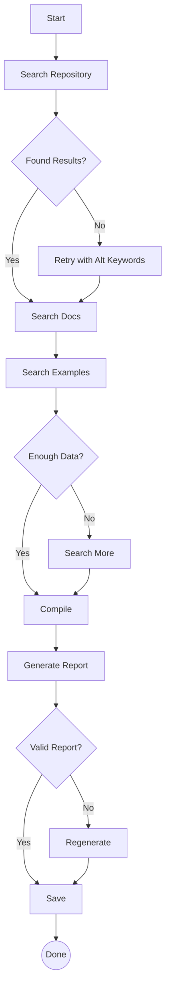

# 🔍 AISOP Repository Search & Report

> **Protocol**: AISOP V3.1  
> **Version**: 1.1.0 stable  
> **ID**: `demo.search_aisop_repo`

---

## 📋 Description

A protocol that uses web search to find all content about the AISOP repository and generate an analysis report. Includes error handling and validation.

---

## 🔧 Tools Required

- `web_search`
- `file_io`

---

## 📥 Parameters

| Parameter | Type | Default | Description |
|:---|:---|:---|:---|
| `repo_url` | string | `https://github.com/aisop-protocol/aisop` | The GitHub repository URL to search for |
| `repo_name` | string | `aisop-protocol/aisop` | Repository name for search queries |
| `output_dir` | string | `./` | Directory to save the report |
| `output_file` | string | `aisop_analysis_report.md` | Filename for the analysis report |

---

## 🗺️ Blueprint: Main Flow


```mermaid
graph TD
  start[Start] --> search_repo[Search Repository]
  search_repo --> check_repo{Found Results?}
  check_repo -->|Yes| search_docs[Search Docs]
  check_repo -->|No| retry_search[Retry with Alt Keywords]
  retry_search --> search_docs
  search_docs --> search_examples[Search Examples]
  search_examples --> check_enough{Enough Data?}
  check_enough -->|Yes| compile[Compile]
  check_enough -->|No| search_more[Search More]
  search_more --> compile
  compile --> generate[Generate Report]
  generate --> validate{Valid Report?}
  validate -->|Yes| save[Save]
  validate -->|No| regenerate[Regenerate]
  regenerate --> save
  save --> endNode((Done))
```

---

## 📝 Functions Summary

| Node | Steps | Description |
|:---|:---|:---|
| `start` | 3 | Display version and target info |
| `search_repo` | 3 | Search GitHub + AISOP protocol |
| `check_repo` | 1 | Decision: found AISOP content? |
| `retry_search` | 2 | Alternative search keywords |
| `search_docs` | 3 | Search SPEC, philosophy, feasibility |
| `search_examples` | 3 | Search examples and architecture |
| `check_enough` | 1 | Decision: >= 5 relevant results? |
| `search_more` | 2 | Additional searches if needed |
| `compile` | 4 | Organize and prioritize results |
| `generate` | 6 | Create markdown report sections |
| `validate` | 1 | Check report completeness |
| `regenerate` | 3 | Fix missing sections |
| `save` | 3 | Save report and confirm |

---

## ✅ Verified On

- Cursor
- Gemini CLI
- ChatGPT
- Claude

---

## 🚀 Usage

```
Read and execute examples/search_aisop_repo.aisop.json
```

---

## 📄 Source File

[📄 search_aisop_repo.aisop.json](./search_aisop_repo.aisop.json)
