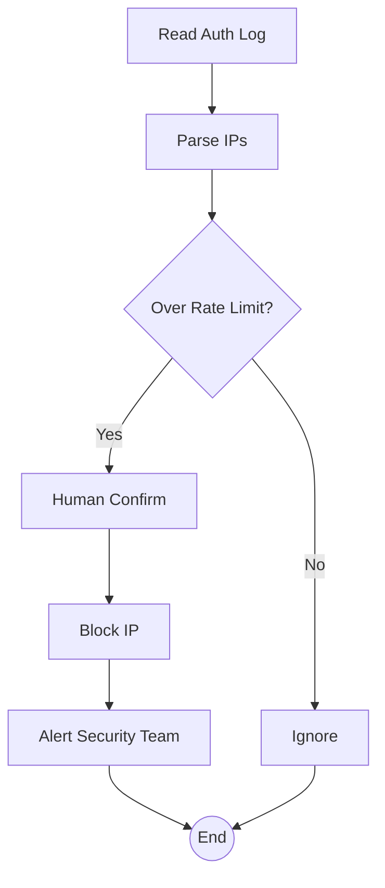

# Security Log Auditor `2.1.0 stable`

> **Protocol**: AISOP V1.0.0 | **ID**: `sec.auditor`
> **Tools**: `shell`, `file_io` | **Verified On**: `Cursor`, `Gemini CLI`

**Summary**: Scans logs.

Audits auth logs and blocks malicious IPs.

---

## 1. System Identity

**System Prompt**:
```text
Execute aisop.main
```

**Instruction**: `Execute aisop.main`

## 2. Parameters

| Parameter | Type | Description | Default |
| :--- | :--- | :--- | :--- |
| `log_file` | `string` | Path to the log file to audit. | - |


## 3. Logic AISOP

The following logic flow allows GitHub to render the Mermaid graph natively.


### AISOP: `main`




## 4. Capabilities (Functions)

| Function Name | First Step (Preview) |
| :--- | :--- |
| `read` | `cat /var/log/auth.log` |
| `parse` | `{'op': 'sys.code', 'lang': 'python', 'code': 'extract_ips...` |
| `rate_limit` | `{'op': 'sys.if', 'condition': 'count > 100'}` |
| `confirm_block` | `{'op': 'sys.io.confirm', 'message': 'Block IP $IP via ipt...` |
| `block` | `iptables -A INPUT -s $IP -j DROP` |
| `ignore` | `echo 'Traffic normal.'` |
| `alert` | `echo '🚨 IP Blocked!'` |


---
*Generated by AISOP MD Generator*
