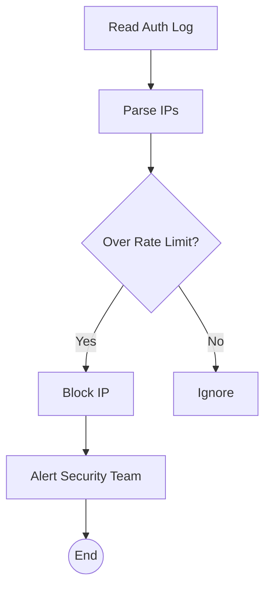

# Security Log Auditor `2.1.0 stable`

> **Protocol**: AISOP V3.1 | **ID**: `sec.auditor`  
> **Tools**: `shell`, `file_io` | **Verified On**: `Cursor`, `Gemini CLI`

Audits auth logs and blocks malicious IPs.

---

## 1. System Identity

**System Prompt**:
```text
Execute blueprints.main
```

## 2. Logic Blueprints

The following logic flow allows GitHub to render the Mermaid graph natively.


### Blueprint: `main`


```mermaid
graph TD
  read[Read Auth Log] --> parse[Parse IPs]
  parse --> rate_limit{Over Rate Limit?}
  rate_limit -->|Yes| block[Block IP]
  rate_limit -->|No| ignore[Ignore]
  block --> alert[Alert Security Team]
  alert --> endNode((End))
```


## 3. Capabilities (Functions)

| Function Name | First Step (Preview) |
| :--- | :--- |
| `read` | `cat /var/log/auth.log` |
| `parse` | `{'op': 'sys.code', 'lang': 'python', 'code': 'extract_ips...` |
| `rate_limit` | `{'op': 'sys.if', 'condition': 'count > 100'}` |
| `block` | `iptables -A INPUT -s $IP -j DROP` |
| `ignore` | `echo 'Traffic normal.'` |
| `alert` | `echo '🚨 IP Blocked!'` |


---
*Generated by AISOP MD Generator*
