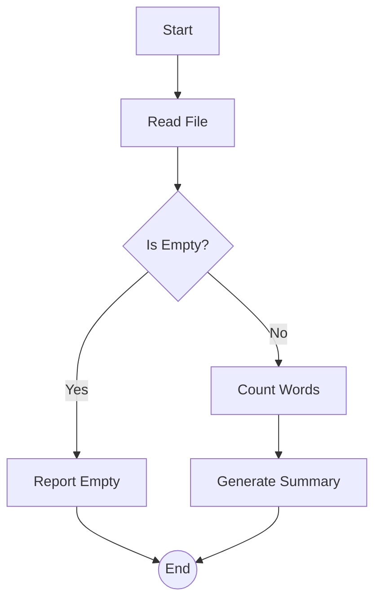
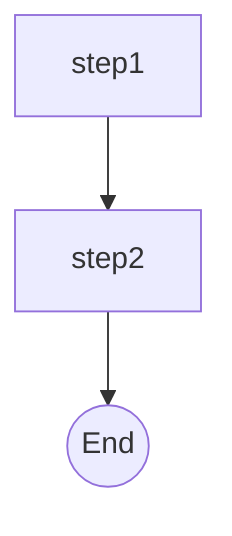

# Simple Reader & Analyzer `1.0.0 stable`

> **Protocol**: AISOP V1.0.0 | **ID**: `demo.simple_reader`
> **Tools**: `file_io`, `shell` | **Verified On**: `Cursor`, `Gemini CLI`

**Summary**: Reads a text file and performs word count analysis.

A minimal example that reads a text file and performs basic analysis.

---

## 1. System Identity

**System Prompt**:
```text
You are a text analysis agent. Execute aisop.main strictly.
```

**Instruction**: `Execute aisop['main'] to analyze the target file.`

## 2. Parameters

| Parameter | Type | Description | Default |
| :--- | :--- | :--- | :--- |
| `target_file` | `string` | Path to the file to analyze | README.md |


## 3. Logic AISOP

The following logic flow allows GitHub to render the Mermaid graph natively.


### AISOP: `main`



### AISOP: `sub_analysis`




## 4. Capabilities (Functions)

| Function Name | First Step (Preview) |
| :--- | :--- |
| `start` | `echo 'Starting Analysis on {target_file}'` |
| `read` | `cat {target_file}` |
| `error` | `echo 'Error: File is empty or missing!'` |
| `analyze` | `wc -w {target_file}` |
| `summary` | `echo 'Analysis Complete. See counts above.'` |


---
*Generated by AISOP MD Generator*
