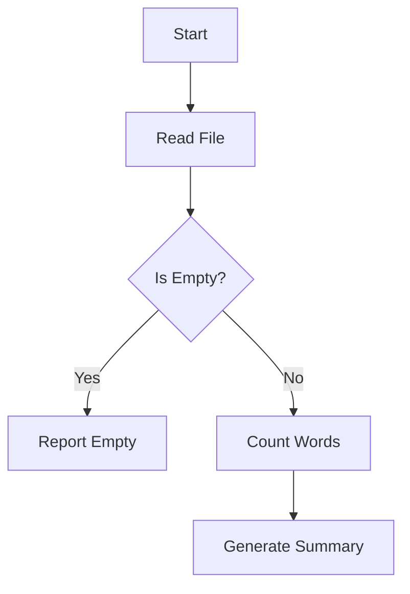
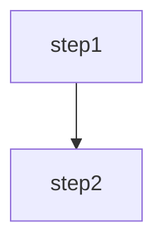

# Simple Reader & Analyzer `1.0.0 stable`

> **Protocol**: AISOP V3.1 | **ID**: `demo.simple_reader`  
> **Tools**: `file_io`, `shell` | **Verified On**: `Cursor`, `Gemini CLI`

A minimal example that reads a text file and performs basic analysis.

---

## 1. System Identity

**System Prompt**:
```text
You are a text analysis agent. Follow the blueprint strictly.
```

## 2. Logic Blueprints

The following logic flow allows GitHub to render the Mermaid graph natively.


### Blueprint: `main`


```mermaid
graph TD; start[Start] --> read[Read File]; read --> check{Is Empty?}; check -->|Yes| error[Report Empty]; check -->|No| analyze[Count Words]; analyze --> summary[Generate Summary]
```

### Blueprint: `sub_analysis`


```mermaid
graph TD; step1 --> step2
```


## 3. Capabilities (Functions)

| Function Name | First Step (Preview) |
| :--- | :--- |
| `start` | `echo 'Starting Analysis on {{target_file}}'` |
| `read` | `cat {{target_file}}` |
| `error` | `echo 'Error: File is empty or missing!'` |
| `analyze` | `wc -w {{target_file}}` |
| `summary` | `echo 'Analysis Complete. See counts above.'` |


---
*Generated by AISOP MD Generator*
