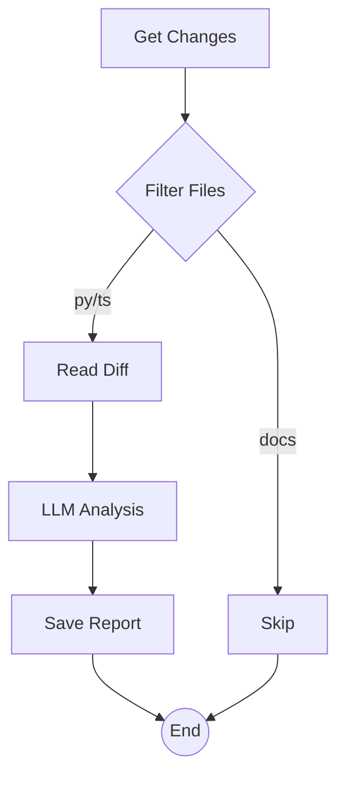

# Smart Code Reviewer `3.2.0 stable`

> **Protocol**: AISOP V1.0.0 | **ID**: `demo.smart_reviewer`
> **Tools**: `git`, `file_io`, `llm` | **Verified On**: `Cursor`, `Gemini CLI`

**Summary**: Code reviewer.

Intelligent code reviewer filtering by file type.

---

## 1. System Identity

**System Prompt**:
```text
Execute aisop.main
```

**Instruction**: `Execute aisop.main`

## 2. Parameters

| Parameter | Type | Description | Default |
| :--- | :--- | :--- | :--- |
| `pr_id` | `string` | Pull Request ID to review. | - |


## 3. Logic AISOP

The following logic flow allows GitHub to render the Mermaid graph natively.


### AISOP: `main`




## 4. Capabilities (Functions)

| Function Name | First Step (Preview) |
| :--- | :--- |
| `start` | `git diff --name-only HEAD~1` |
| `read` | `git diff HEAD~1` |
| `analyze` | `{'op': 'sys.llm', 'prompt': 'Review this code...'}` |
| `report` | `echo '{nodes.analyze.output}' > review.md` |
| `skip` | `echo 'Skipping review.'` |


---
*Generated by AISOP MD Generator*
