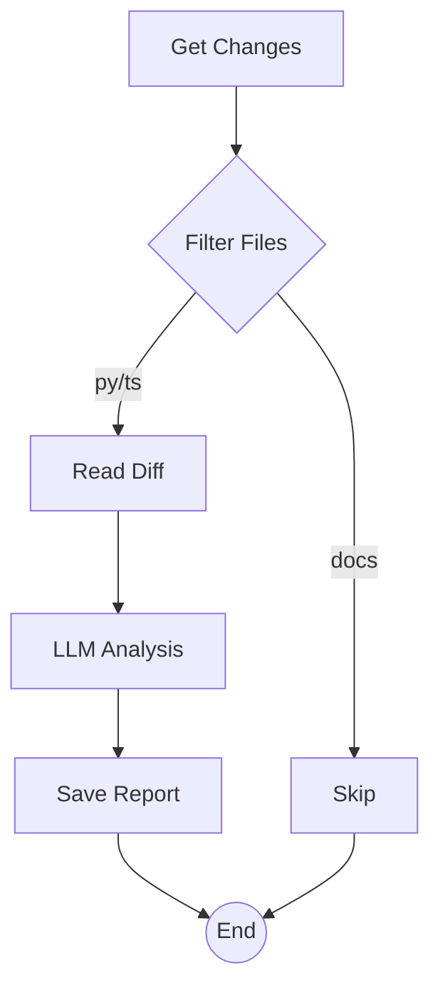

# Smart Code Reviewer `3.2.0 stable`

> **Protocol**: AISOP V3.1 | **ID**: `demo.smart_reviewer`  
> **Tools**: `git`, `file_io`, `llm` | **Verified On**: `Cursor`, `Gemini CLI`

Intelligent code reviewer filtering by file type.

---

## 1. System Identity

**System Prompt**:
```text
Execute blueprints.main
```

## 2. Logic Blueprints

The following logic flow allows GitHub to render the Mermaid graph natively.


### Blueprint: `main`


```mermaid
graph TD
  start[Get Changes] --> filter{Filter Files}
  filter -->|py/ts| read[Read Diff]
  filter -->|docs| skip[Skip]
  read --> analyze[LLM Analysis]
  analyze --> report[Save Report]
  report --> endNode((End))
  skip --> endNode
```


## 3. Capabilities (Functions)

| Function Name | First Step (Preview) |
| :--- | :--- |
| `start` | `git diff --name-only HEAD~1` |
| `read` | `git diff HEAD~1` |
| `analyze` | `{'op': 'sys.llm', 'prompt': 'Review this code...'}` |
| `report` | `echo '${{ nodes.analyze.output }}' > review.md` |
| `skip` | `echo 'Skipping review.'` |


---
*Generated by AISOP MD Generator*
