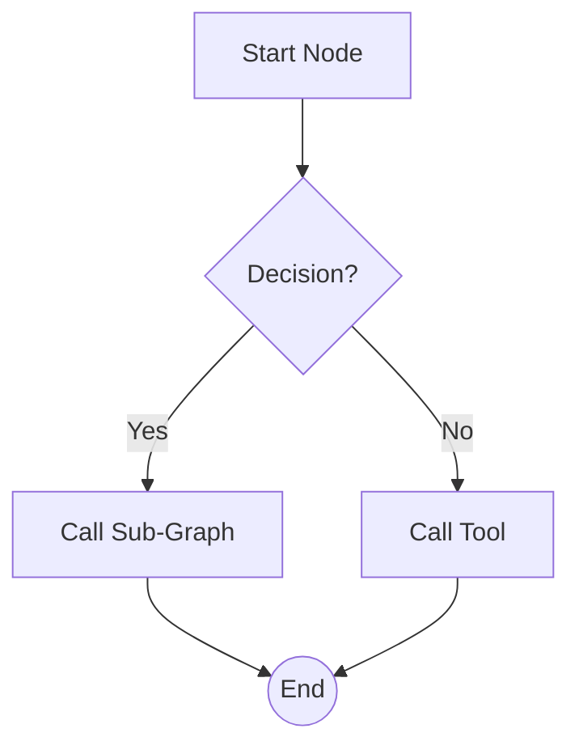
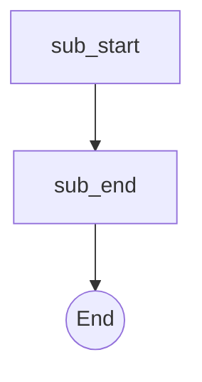

# Standard AISOP Template `1.0.0 stable`

> **Protocol**: AISOP V1.0.0 | **ID**: `your.domain.project.task`
> **Tools**: `shell` | **Verified On**: `Cursor`, `Gemini CLI`

**Summary**: Short description of what this AISOP does.

Standard template with description field.

---

## 1. System Identity

**System Prompt**:
```text
# Role: AISOP Virtual Runtime
Execute aisop.main
```

**Instruction**: `Execute aisop['main'].`

## 2. Parameters

| Parameter | Type | Description | Default |
| :--- | :--- | :--- | :--- |
| `target_dir` | `string` | Directory to process. | - |


## 3. Logic AISOP

The following logic flow allows GitHub to render the Mermaid graph natively.


### AISOP: `main`



### AISOP: `sub_task`




## 4. Capabilities (Functions)

| Function Name | First Step (Preview) |
| :--- | :--- |
| `simple_tool` | `echo 'Hello World'` |
| `multi_step_tool` | `echo 'Starting...'` |
| `llm_tool` | `{'op': 'sys.llm', 'prompt': 'Analyze this...'}` |
| `sub_task` | `aisop['sub_task']` |


---
*Generated by AISOP MD Generator*
