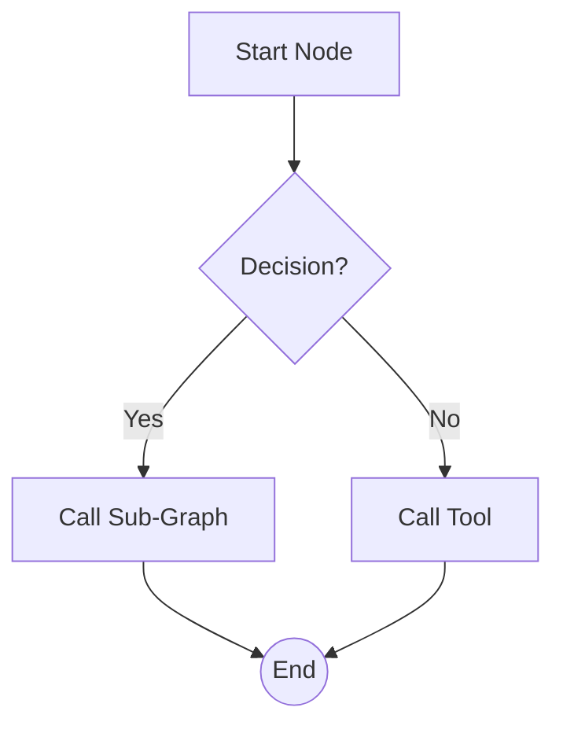
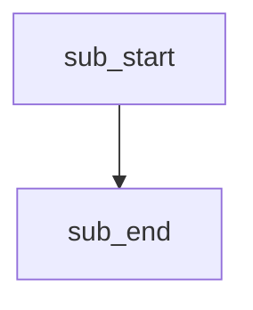

# Standard AISOP Template `1.0.0 stable`

> **Protocol**: AISOP V3.1 | **ID**: `your.domain.project.task`  
> **Tools**: `shell` | **Verified On**: `Cursor`, `Gemini CLI`

Standard template with description field.

---

## 1. System Identity

**System Prompt**:
```text
# Role: AISOP Virtual Runtime v3
Execute blueprints.main
```

## 2. Logic Blueprints

The following logic flow allows GitHub to render the Mermaid graph natively.


### Blueprint: `main`


```mermaid
graph TD
  start[Start Node] --> check{Decision?}
  check -->|Yes| sub_task[Call Sub-Graph]
  check -->|No| atomic_tool[Call Tool]
  sub_task --> endNode((End))
  atomic_tool --> endNode
```

### Blueprint: `sub_task`


```mermaid
graph TD
  sub_start --> sub_end
```


## 3. Capabilities (Functions)

| Function Name | First Step (Preview) |
| :--- | :--- |
| `simple_tool` | `echo 'Hello World'` |
| `multi_step_tool` | `echo 'Starting...'` |
| `llm_tool` | `{'op': 'sys.llm', 'prompt': 'Analyze this...'}` |
| `sub_task` | `blueprints['sub_task']` |


---
*Generated by AISOP MD Generator*
